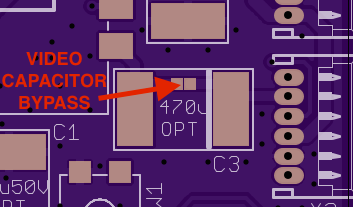

# Custom FPV Transmitter for ZMR250

### Origins:

I had a number of annoyances related to the BOSCAM FPV transmitter I initially purchased for my ZRM250 quadcopter. I also stumbled across a [German RC forum post](http://fpv-treff.de/viewtopic.php?f=23&t=5974) where an individual had developed their own transmitter based around the TX5823 200mW 5.8GHz transmitter found in many pre-packaged FPV transmitters. While not perfect, it was a great starting point and served as the inspiration for this project.

There are a number of differences from the original work, specifically the ATTiny software and PCB layout are completely new.

### Project Objectives:

This project seeks to produce a 200mW FPV transmitter with the following specifications:

- Easily mounted securely on the ZMR250 frame.
- Simple to change channels (no buried DIP switches!!)
- Has frequency agility supporting all current receiver channels

### Current Status:

**ATTiny Firmware:** I have prototyped the software on a PDIP ATTiny board and the system control is functioning correctly. I have not tested the SPI code yet, but it is borrowed directly from the *rx5808-pro* project.

**Hardware:** Boards were just received from FAB, they have been tested and look good, and I will be populating them and testing them soon. The boards were made through OSHPark and are available [here](https://oshpark.com/shared_projects/drxYzrrf) - $12 for 3 copies. I would not recommend anyone purchase them until I have tested the boards to ensure they work!

### Files In Repository:

- 5G8_fpv_tx.sch		Eagle PCB schematic for transmitter board
- 5G8_fpv_tx.brd		Eagle PCB layout for transmitter board
- attiny/			ATTiny related files and firmware for board
- ZMR250_FPV_TX.zip		Compressed archive of gerber files for board

### RX5823 Module Modifications

It is necessary to modify the TX5823 module so it is able to operate in SPI mode. The modification only require the removal of a single resistor, however it is under the metal shield on the module, so you will need to remove that first. The easiest way to do that is to work one side at a time (they are soldered on two sides) with a soldering iron and precision slotted screwdriver. Use the screwdriver between the module board and shield to *gently* apply pressure while melting the solder. If you work carefully, alternating sides, and taking breaks to allow the module to cool down it is fairly easy to remove the shield. Clean up any excess solder, and remove the resistor shown in the following image:

After removing the resistor, ensure you have not accidentally shorted anything, and replace the shield. This only needs to be done once per module, so you can re-solder the shield to the module PCB.

### Transmitter Operation

The transmitter will remember the last channel used and will automatically configure to this channel on startup. To view the current frequency, you can push the button once quickly and the LED will flash the current band (1-5) followed by a brief pause, followed by the current channel (1-8). To change the frequency, the following procedure should be used:

1. Press and hold the button until the LED turns off and immediately release it. In order to prevent accidental channel changing if you hold it too long, or release it too early it will not set the frequency.
2. The LED will flash quickly and stop. Press the button to set the band (eg: 3 presses will select band 3, "Band E"). If you press the button more than 5 times (the total number of supported bands), it will loop back to 1.
3. Wait for the LED to flash quickly again and set the channel using the same procedure as above. There are 8 channels in each band, and pressing more than 8 times will loop back to 1.
4. Release the button and wait for confirmation that the band has been set (LED long flash, followed by the band, followed by the channel, followed by another long LED flash). The transmitter is now reconfigured and will immediately update the frequency of the module, and will start with the new channel in the future.
5. If the button is not pressed to select the band or channel, the frequency selection mode will exit and flash the LED quickly many times. There will be no change to the current or startup channel.

I am not sure if I like this scheme, but it's a good start that only requires one button and one LED.

### Video Input Capacitor

The TX5823 module specifies a 470uF capacitor on the video input line. These are rather expensive, and I'm not sure it is strictly necessary so I added pads that can be solder-jumpered to bypass the capacitor. This is hilighted below, I will test both ways and update this with that information.

