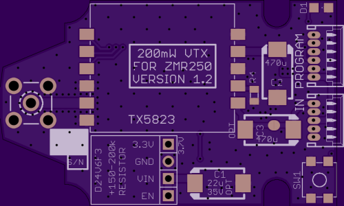
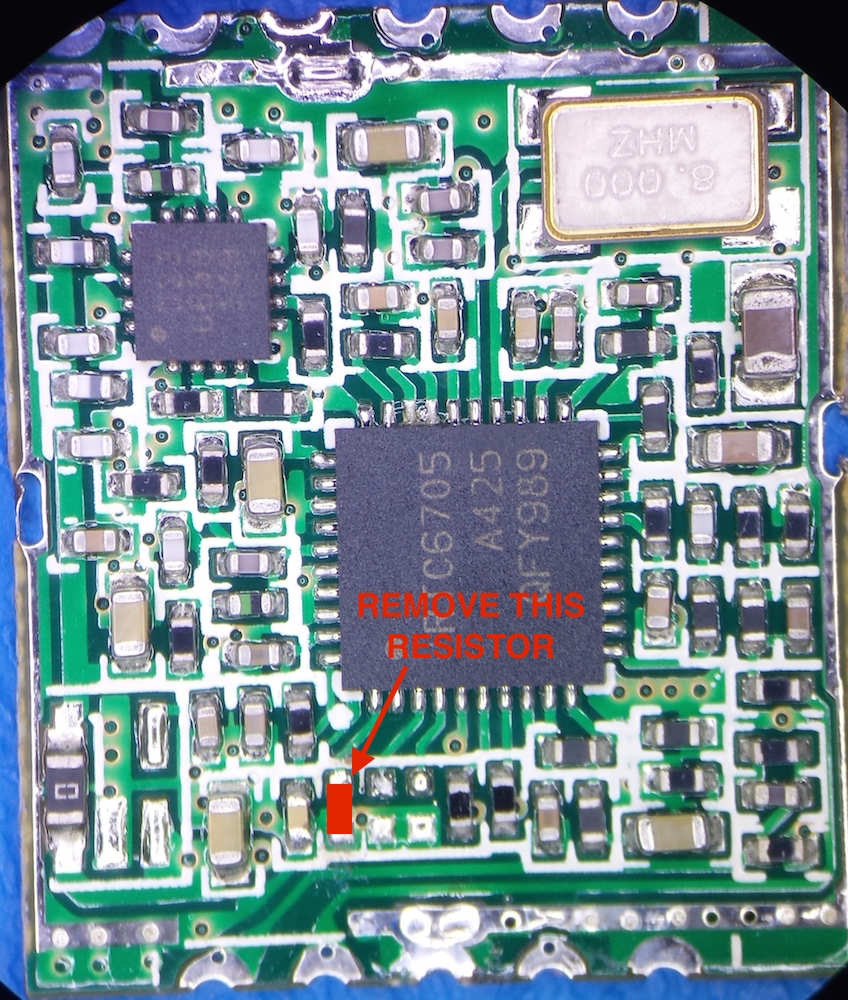

# Custom FPV Transmitter for ZMR250

### Origins:

I had a number of annoyances related to the BOSCAM FPV transmitter I initially purchased for my ZRM250 quadcopter. I also stumbled across a [German RC forum post](http://fpv-treff.de/viewtopic.php?f=23&t=5974) where an individual had developed their own transmitter based around the TX5823 200mW 5.8GHz transmitter found in many pre-packaged FPV transmitters. While not perfect, it was a great starting point and served as the inspiration for this project.

There are a number of differences from the original work, specifically the ATTiny software and PCB layout are completely new.

### Project Objectives:

This project seeks to produce a 200mW FPV transmitter with the following specifications:

- Easily mounted securely on the ZMR250 frame.
- Simple to change channels (no buried DIP switches!!)
- Has frequency agility supporting all current receiver channels

### Current Status:

**ATTiny Firmware:** I have prototyped the software on a PDIP ATTiny board and the system control is functioning correctly. I have not tested the SPI code yet, but it is borrowed directly from the *rx5808-pro* project.

**Hardware:** Boards were just received from FAB, they have been tested and look good, and I will be populating them and testing them soon. The boards were made through OSHPark and are available [here](https://oshpark.com/shared_projects/drxYzrrf) - $12 for 3 copies. I would not recommend anyone purchase them until I have tested the boards to ensure they work!

### Files In Repository:

- 5G8_fpv_tx.sch		Eagle PCB schematic for transmitter board
- 5G8_fpv_tx.brd		Eagle PCB layout for transmitter board
- attiny84_transmitter.ino	Arduino sketch for ATTiny84
- ZMR250_FPV_TX.zip		Compressed archive of gerber files for board

### ATTiny 84 Firmware:

The ATTiny84 firmware was written in Arduino because it's quick and easy. I'll try to upload a hex file at some point. Programming instructions are based on the [work by HighLowTech](http://highlowtech.org/?p=1695) and are pretty straightforward. A dedicated programming header is located on the board, but that might chance since firmware should not need to change very often. The board contains current-limiting resistors on MOSI and SCK lines to allow for 5V programming.

It is important to note that the ATTiny runs from the same 3.3V supply as the video transmitter, and the VTX will be powered anytime the ATTiny is! Be sure to connect an antenna, or terminate the SMA connector so it is not damaged.

### RX5823 Module Modifications

It is necessary to modify the TX5823 module so it is able to operate in SPI mode. The modification only require the removal of a single resistor, however it is under the metal shield on the module, so you will need to remove that first. The easiest way to do that is to work one side at a time (they are soldered on two sides) with a soldering iron and precision slotted screwdriver. Use the screwdriver between the module board and shield to *gently* apply pressure while melting the solder. If you work carefully, alternating sides, and taking breaks to allow the module to cool down it is fairly easy to remove the shield. Clean up any excess solder, and remove the resistor shown in the following image:

After removing the resistor, ensure you have not accidentally shorted anything, and replace the shield. This only needs to be done once per module, so you can re-solder the shield to the module PCB.
