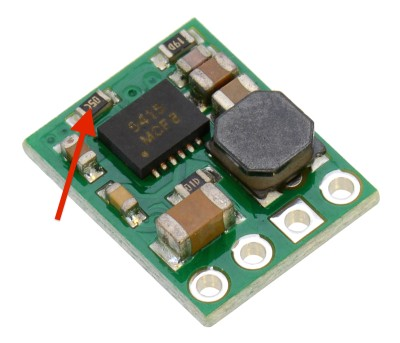
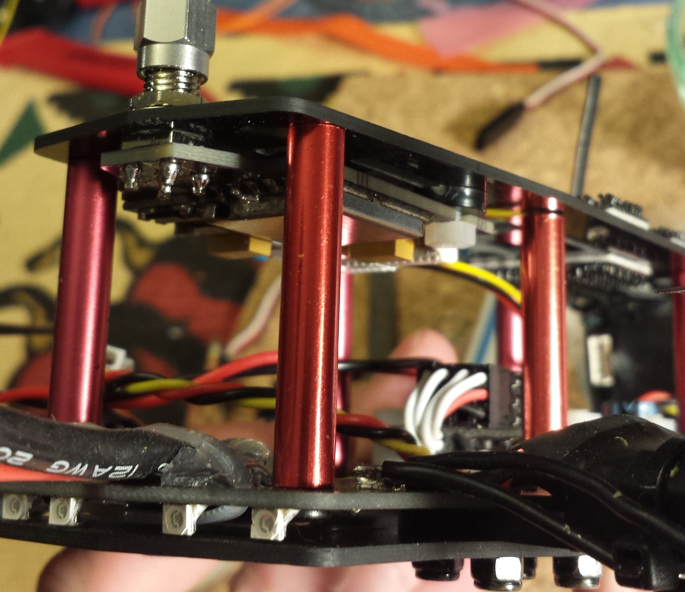

# Custom FPV Transmitter for ZMR250: The ZTX-23

I suggest you read this entire README prior to building this, it's not that long and there is valuable information here!

### Version 1.2 Changelog:

The version 1.2 hardware has resolved a few issues and annoyances:

- Addition of LDO to resolve SMPS noise in video
- Input connector is now a 5-pin picoblade to distinguish from the programming header
- Changed footprint for 7343 capacitors
- Switch and LED positions are changed for easier access
- Requires modification of the Pololu module

The remainder of this guide is for v1.2 only.

### Origins:

I had a number of annoyances related to the BOSCAM FPV transmitter I initially purchased for my ZRM250 quadcopter. It was difficult to change frequencies, mounting wasn't ideal, and most of all for whatever reason, it only put out 13.1 dBm (~20mW). I knew I was going to need another one, and I happened to stumble across a [German RC forum post](http://fpv-treff.de/viewtopic.php?f=23&t=5974) where an awesome guy developed a custom transmitter based around the TX5823 200mW 5.8GHz transmitter found in many pre-packaged FPV transmitters. While not exactly what I wanted, it was a great starting point and served as the inspiration for this project.

There are a number of differences from the original work, specifically the ATTiny software and PCB layout are completely new, but they get a ton of credit for all the great stuff in that forum .

### Project Objectives:

This project seeks to produce a 200mW FPV transmitter with the following specifications:

- Easily mounted securely on the ZMR250 frame
- Low profile and does not inhibit use of 6" propellers
- Simple to change channels (no buried DIP switches!)
- Direct 3S/4S power input
- Has frequency agility supporting all current receiver channels (including IRC's new 'RaceBand'!)

### Current System Status Overview:

**ATTiny Firmware:** The current ATTiny firmware has been tested on the hardware platform successfully! There are no known issues with the current software. I have used it many times and overall I am quite pleased. All 5 bands (40 channels total) have been implemented.

**Hardware:** The v2.1 boards were just received from FAB and have been populated and tested - they function great. These were made through OSHPark and can be ordered [here](https://oshpark.com/shared_projects/h9UIDucG) - $12 for 3 copies. There are several optional components, which are detailed in a subsequent section.

**Weight:** While reducing weight was not a project objective, 250 racers and their pilots are weight-conscious if not sensitive. I made a few measurements and here is how this transmitter measures up. I was previously using a TS351 in a neat 3D printed holder, but it was pretty heavy:

| Hardware     | Weight   | Comments                                  |
|--------------|----------|-------------------------------------------|
|BOSCAM TS351  |23.7g     |Transmitter only, no mounting hardware     |
|TS5823        |8g        |Transmitter only, no mounting hardware     |
|ZTX-23        |**13.3g** |Includes all mounting and cables!          |
|SMA Extension |7g        |30.7g with BOSCAM and no mounting hardware |

So this transmitter is not the lightest transmitter out there, but considering this includes all material required to securely install the transmitter to the frame, I am very pleased.

**Video Quality:** The ZTX-23 works really great. I tested bypassing the 3.3V LDO and using the Pololu module output directly, and one module looked okay, while the other had significant noise. With the LDO, crystal clear video. At this point I recommend using the LDO (it's ~$0.50) and making the modification to the Pololu module mentioned below.

### Repository Structure:

- eagle/			Eagle PCB files
- attiny/			ATTiny related files and firmware for board
- FPV_TX_BOM.xlsx		Bill of materials to populate boards
- ZMR250_FPV_TX_v1.2.zip	Compressed archive of all gerber files
- README_v1.0.md		Version 1.0 README, out of date but preserved
- README.md			This README

### Bill of Materials:

BOM is up. There are only a handful of components, but the large capacitors are all 7343 size tantalum and the small capacitors are all 0.1uf decoupling caps, the Pololu module is a 500mA 3.3V SMPS, R1 is 330 ohm and R2/R3 are 3.3k. The LDO (U2) is an AP2112 3.3V fixed-output reg. All the small passives are 0805 (however SparkFun's 0805 footprint is a little tight... If you have 'em use 0603 for bypass capacitor and resistors).

### Component Modifications:

Both the TX5823 module and Pololu SMPS must be modified before they can be used for this application.

**TX5823 Module Modifications:** It is necessary to modify the TX5823 module so it is able to operate in SPI mode. The modification only require the removal of a single resistor, however it is under the metal shield on the module, so you will need to remove that first. The easiest way to do that is to work one side at a time (they are soldered on two sides) with a soldering iron and precision slotted screwdriver. Use the screwdriver between the module board and shield to *gently* apply pressure while melting the solder. If you work carefully, alternating sides, and taking breaks to allow the module to cool down it is fairly easy to remove the shield. Clean up any excess solder, and remove the resistor shown in the following image:

After removing the resistor, inspect the board (preferrably under a magnifying glass) to ensure you have not accidentally caused any shorts or displaced any other components; replace the shield. This only needs to be done once so you can re-solder the shield to the module PCB.

**Pololu Module Modification:** In order to use the 3.3V LDO, the input must be around 3.6V due to the dropout voltage. This requires a change in the Pololu module, which fortunately is simple - soldering a resistor in parallel with 22.1k R2 on the Pololu module will increase the module output voltage by approximately 350mV and will properly power the LDO. This combination has good efficency on 3S/4S and provides clean power.

The resistor that must be changed by adding another in parallel is shown above, simply solder a ~150k resistor in parallel with it.

### Mounting Transmitter:

One of the design criteria for this transmitter was mounting natively to the ZMR250 frame. Consistant with that, it has been designed to mount cleanly to the rear of the top plate, though the hole in the rear must be drilled out with a 0.25" bit to accomodate the SMA connector. By mounting the SMA connector directly to the frame, it is very unlikely that a crash will damage the transmitter. Be careful drilling carbon fiber as it can be a little tricky, and don't inhale the dust!

On the other end from the SMA connector are two slots that will nicely fit M3 nylon hardware. A spacer is needed to keep some standoff from the conductive frame. I used the smallest diameter HQ propeller mounting bushings since they were a pretty good fit but I'll probably 3D print some spacers that are sized better and post the files when I am happy.

### Transmitter Operation

The transmitter will remember the last channel used and will automatically configure to this channel on startup. To view the current frequency, you can push the button once quickly and the LED will flash the current band (1-5) followed by a brief pause, followed by the current channel (1-8). To change the frequency, the following procedure should be used:

1. Press and hold the button until the LED turns off and immediately release it. In order to prevent accidental channel changing if you hold it too long, or release it too early it will not set the frequency.
2. The LED will flash quickly and stop. Press the button to set the band (eg: 3 presses will select band 3, "Band E"). If you press the button more than 5 times (the total number of supported bands), it will loop back to 1.
3. Wait for the LED to flash quickly again and set the channel using the same procedure as above. There are 8 channels in each band, and pressing more than 8 times will loop back to 1.
4. Release the button and wait for confirmation that the band has been set (flashes indicating the band, followed by the channel). The transmitter is now reconfigured and will immediately update the frequency of the module, and will start with the new channel in the future.
5. If the button is not pressed to select the band or channel, the frequency selection mode will exit and flash the LED quickly many times. There will be no change to the current or startup channel.

I think I like this scheme but I'm not sure; it might change. Either way, it's a good start that only requires one button and one LED.

### Optional Components:

**Video Input Capacitor:** The TX5823 module specifies a 470uF capacitor on the video input line (C3). These are rather expensive, and I'm not sure it is strictly necessary so I added pads that can be solder-jumpered to bypass the capacitor. I have tested both with and without this cap, and could not see a difference. I will most likely not purchase these again.

**Pololu Module Capacitor:** Pololu recommends the use of a large value capacitor to prevent damage from any turn-on voltage spike. They suggest an input of under 20V with short leads should be fine, but I included the pads anyway. I include them just in case, but like the video input cap, these are fairly expensive. If you do use one, make sure it is rated for the appropriate voltage.

**Audio Grounding Resistor:** I included pads for a resistor (R4) that can be used to terminate the audio input, which is no longer connected to the input connector. Feel free to omit this.

**Noise Reduction Capacitor:** The LDO NR capacitor (C6) should only be used with LDOs that require this. The AP2112 I have in the BOM has this pin as a NC and thus C6 should NOT be populated.

